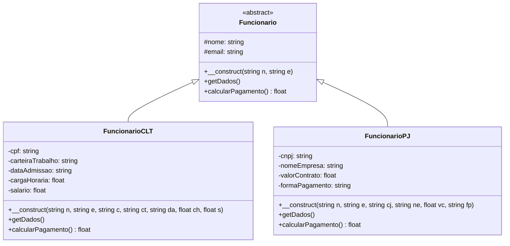

```mermaid
classDiagram
    
    Funcionario <|-- FuncionarioCLT
    Funcionario <|-- FuncionarioPJ

    class Funcionario {
        <<abstract>>    
        #nome: string
        #email: string
        +__construct(string n, string e)
        +getDados()
        +calcularPagamento() float
    }

    class FuncionarioCLT {
        -cpf: string
        -carteiraTrabalho: string
        -dataAdmissao: string
        -cargaHoraria: float
        -salario: float
        +__construct(string n, string e, string c, string ct, string da, float ch, float s)
        +getDados()
        +calcularPagamento() float
    }

    class FuncionarioPJ {
        -cnpj: string
        -nomeEmpresa: string
        -valorContrato: float
        -formaPagamento: string
        +__construct(string n, string e, string cj, string ne, float vc, string fp)
        +getDados()
        +calcularPagamento() float
    }
```